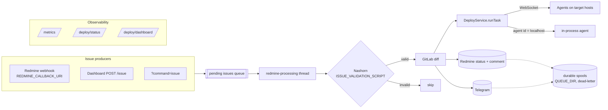

# deploy

A small deployment-orchestration server. A central **Vert.x** process accepts **WebSocket agents**
running on target hosts and dispatches shell commands to them. Deployments are driven from
**Redmine** issues: an issue is validated by a script, its GitLab diff is posted back as a comment
(and to Telegram), the referenced deploy alias is executed across agents, and the issue status is
moved Accepted → Processing → Done/Failed. Outbound Redmine and Telegram calls go through
**durable, at-least-once disk queues** with dead-lettering. The server exposes Prometheus metrics,
a JSON status endpoint, and a live **htmx/SSE dashboard**.

> The HTTP/WebSocket server binds to **`127.0.0.1` only** and none of the endpoints are
> authenticated. Put it behind a reverse proxy (and add auth there) if you need remote access.

## Architecture



- **Server ↔ agents**: agents open a WebSocket to `SERVER_BASE_URL + AGENT_ID`; the server keys each
  connection by the last path segment of the URL. A deploy `Task` is a list of commands, each
  targeting one or more agent ids; the special id `localhost` runs in-process on the server.
- **Redmine flow**: issues enter a bounded in-memory queue (webhook callback, dashboard, or
  `?command=issue`), are validated by a Nashorn script, diffed against GitLab, deployed, and their
  status is updated. All Redmine mutations and Telegram messages are enqueued to disk first
  (`QUEUE_DIR`) and retried with backoff; poison operations move to a `dead/` sub-directory.

## Modules

| Module | Purpose |
|---|---|
| `util` | `IStartupConfig` marker for env-driven config. |
| `commands` | Standalone CLI helper commands run by agents (runner, check-version, wait-url). |
| `agent-api` | Wire contract between server and agent (messages, `AgentCommand`). |
| `server-api` | Server-side domain contract (`IDeployService`, `Task`, listeners). |
| `agent` | Agent runtime: executes shell commands via `ProcessBuilder`. |
| `server` | Transport-agnostic core: `DeployServiceImpl`, alias parsing, local agent. |
| `client-redmine` | Redmine/GitLab/Telegram integration + durable queues (`PersistentSpool`). |
| `server-vertx` | Vert.x runtime and entry point; HTTP routing, dashboard/status/metrics. |
| `agent-websocket` | WebSocket agent entry point. |
| `integration-test` | End-to-end tests wiring the server and a WebSocket agent. |

## Build & test

Requires **JDK 21** (compiler `source`/`target` = 21).

```bash
./mvnw -B -ntp verify      # Maven wrapper pins Maven 3.9.4
# or, with a local Maven:
mvn  -B -ntp verify
```

Run a single test across the reactor:

```bash
mvn -B -ntp test -Dtest=DashboardViewTest#latencyRendersPercentileBars \
    -Dsurefire.failIfNoSpecifiedTests=false
```

(`-Dsurefire.failIfNoSpecifiedTests=false` is needed so modules that don't contain the named test
don't fail the run.)

## Running the server

Build produces a fat jar via the assembly plugin:

```bash
java -jar server-vertx/target/server-vertx-1.0-SNAPSHOT-jar-with-dependencies.jar
```

Main class: `io.pne.deploy.server.vertx.VertxServerApplication`. Configuration comes from
environment variables (defaults in parentheses):

**Server**

| Env var | Default | Meaning |
|---|---|---|
| `VERTX_SERVER_PORT` | `8080` | HTTP/WebSocket listen port (bound to `127.0.0.1`). |
| `VERTX_ALIASES_DIR` | `./aliases` | Directory of deploy alias `*.yml` files. |

**Dashboard**

| Env var | Default | Meaning |
|---|---|---|
| `DASHBOARD_PATH` | `/deploy/dashboard` | Dashboard base path. |
| `DASHBOARD_REFRESH_MS` | `2000` | SSE push interval (ms). |

**Redmine / GitLab / Telegram / queue**

| Env var | Default | Meaning |
|---|---|---|
| `REDMINE_URL` | `""` | Redmine base URL. |
| `REDMINE_API_ACCESS_KEY` | `""` | Redmine API key (**secret**). |
| `REDMINE_STATUS_ACCEPT_ID` | `1` | Status id: accepted. |
| `REDMINE_STATUS_PROCESSING_ID` | `2` | Status id: in progress. |
| `REDMINE_STATUS_DONE_ID` | `3` | Status id: done. |
| `REDMINE_STATUS_FAILED_ID` | `6` | Status id: failed. |
| `REDMINE_CONNECT_TIMEOUT` | `120` | Connect timeout (s). |
| `REDMINE_READ_TIMEOUT` | `120` | Read timeout (s). |
| `REDMINE_CALLBACK_URI` | `""` | HTTP URI matched for the Redmine webhook. |
| `ISSUE_VALIDATION_SCRIPT` | `""` | Path to a JS file validating each issue (Nashorn). |
| `STATUS_PAGE_PATH` | `/deploy/status` | Status endpoint path prefix. |
| `QUEUE_DIR` | `./queue` | Durable spool root (`redmine/` and `telegram/` subdirs). |
| `GITLAB_URL` | `""` | GitLab base URL. |
| `GITLAB_API_KEY` | `""` | GitLab API key. |
| `TELEGRAM_ENABLED` | `false` | Enable Telegram notifications. |
| `TELEGRAM_CHAT_ID` | `0` | Target Telegram chat id. |
| `TELEGRAM_TOKEN` | `""` | Telegram bot token (**secret**). |

## Running an agent

```bash
SERVER_BASE_URL=ws://server-host:8080/ AGENT_ID=web-01 \
  java -jar agent-websocket/target/agent-websocket-1.0-SNAPSHOT-jar-with-dependencies.jar
```

Main class: `io.pne.deploy.agent.websocket.WebSocketAgentApplication`. Both env vars are
**required** (the process throws on startup if either is missing):

| Env var | Meaning |
|---|---|
| `SERVER_BASE_URL` | WebSocket base URL; `AGENT_ID` is appended to it to form the connect URL, so it should end with `/`. |
| `AGENT_ID` | Agent identity (the last path segment the server keys on). |

The agent reconnects automatically (1s backoff) on any disconnect. The built-in `localhost` agent id
is served in-process by the server and needs no external agent.

## HTTP endpoints

All served by the single Vert.x server on `127.0.0.1:<VERTX_SERVER_PORT>`.

| Method | Path | Description |
|---|---|---|
| POST | `REDMINE_CALLBACK_URI` (exact) | Redmine webhook; JSON body `{"issue_id": <long>}` enqueues an issue. |
| GET | `DASHBOARD_PATH` | Live dashboard HTML shell. |
| GET | `DASHBOARD_PATH/events` | SSE stream (cards: service, agents, status, issues, queues, latency). |
| GET | `DASHBOARD_PATH/htmx.min.js`, `/sse.js` | Vendored htmx assets (offline). |
| POST | `DASHBOARD_PATH/issue` | Form field `issue_id` → enqueue; returns the refreshed list. |
| GET | `STATUS_PAGE_PATH` (prefix, default `/deploy/status`) | JSON `{connectedAgents, issueQueue, taskStatus}`. |
| GET | `/metrics` (exact) | Prometheus exposition. |
| GET | `/?command=listAgents` | List connected agents. |
| GET | `/?command=run&alias=<alias …>` | Parse and run an alias asynchronously. |
| GET | `/?command=issue&issue_id=<long>` | Enqueue an issue. |

## Deploy aliases

An alias is a YAML file `<VERTX_ALIASES_DIR>/<name>.yml`. Issues trigger a deploy via a
`> deploy <alias …>` line in their description. Alias text is substituted with positional
parameters `$1, $2, …` and `$ISSUE_ID`. Each command names the target `agents` (comma-separated
ids), an executable `name`, and its `arguments`. Example (`server/src/test/resources/aliases/proc.yml`):

```yaml
commands:
- agents: localhost,localhost
  name: echo
  arguments:
    - arg 1
    - $1

- agents: localhost
  name: echo
  arguments:
    - parameter 2
    - $1
```

## Metrics

Prometheus meters at `/metrics`, tagged `queue="telegram"` / `queue="redmine"`:

- `deploy_queue_pending`, `deploy_queue_dead` (gauges)
- `deploy_queue_sent_total`, `deploy_queue_deadlettered_total` (counters)
- `deploy_queue_send_latency` (timer histogram; p50/p95/p99)

plus standard JVM (memory/GC/threads) and process metrics.

## Security notes

- The server listens on loopback only and **no endpoint is authenticated** — the `run`/`issue`
  commands and the dashboard action can trigger deploys, so keep it local or behind an
  authenticating proxy.
- Provide all secrets (`REDMINE_API_ACCESS_KEY`, `TELEGRAM_TOKEN`) via environment variables.
  Note: the tracked `test.env` and `release-deploy-server.sh` currently contain plaintext secrets
  and should be rotated and removed from version control.

## CI

GitHub Actions (`.github/workflows/ci.yml`) builds and tests on Temurin JDK 21 with
`mvn -B -ntp verify`, on pushes to `master` and on all pull requests.
