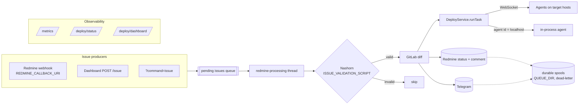

import { Card, CardGrid, Aside } from '@astrojs/starlight/components';

**deploy** is a small deployment-orchestration server. A central **Vert.x** process accepts
**WebSocket agents** running on target hosts and dispatches shell commands to them. Deployments
are driven from **Redmine** issues: an issue is validated by a script, its GitLab diff is posted
back as a comment (and to Telegram), the referenced deploy [alias](/deploy/guides/writing-aliases/) is
executed across agents, and the issue status is moved Accepted → Processing → Done/Failed.
Outbound Redmine and Telegram calls go through durable, at-least-once disk queues with
dead-lettering. The server exposes Prometheus metrics, a JSON status endpoint, and a live
htmx/SSE dashboard.

<Aside type="danger" title="Not exposed to the internet">
The HTTP/WebSocket server binds to <code>127.0.0.1</code> only and **none of the endpoints are
authenticated**. Put it behind a reverse proxy (and add auth there) if you need remote access —
the `run` and `issue` commands and the dashboard action can trigger deploys.
</Aside>

## Architecture

- **Server ↔ agents** — agents open a WebSocket to `SERVER_BASE_URL + AGENT_ID`; the server keys
  each connection by the last path segment of the URL. A deploy `Task` is a list of commands,
  each targeting one or more agent ids; the special id `localhost` runs in-process on the server.
- **Redmine flow** — issues enter a bounded in-memory queue (webhook callback, dashboard, or
  `?command=issue`), are validated by a Nashorn script, diffed against GitLab, deployed, and
  their status is updated. All Redmine mutations and Telegram messages are enqueued to disk first
  (`QUEUE_DIR`) and retried with backoff; poison operations move to a `dead/` sub-directory.

## Explore the docs

<CardGrid>
  <Card title="Install & run" icon="rocket">
    Build with JDK 21 and run the [server and agents](/deploy/installation/).
  </Card>
  <Card title="Configuration" icon="setting">
    Every [environment variable](/deploy/configuration/), its default, and what it controls.
  </Card>
  <Card title="Write aliases" icon="document">
    Define deploys as [alias YAML files](/deploy/guides/writing-aliases/).
  </Card>
  <Card title="Write commands" icon="seti:shell">
    What a [command](/deploy/guides/writing-commands/) is and the bundled helper CLIs.
  </Card>
</CardGrid>

## Modules

| Module | Purpose |
|---|---|
| `util` | `IStartupConfig` marker for env-driven config. |
| `commands` | Standalone CLI helper commands run by agents (runner, check-version, wait-url). |
| `agent-api` | Wire contract between server and agent (messages, `AgentCommand`). |
| `server-api` | Server-side domain contract (`IDeployService`, `Task`, listeners). |
| `agent` | Agent runtime: executes shell commands via `ProcessBuilder`. |
| `server` | Transport-agnostic core: `DeployServiceImpl`, alias parsing, local agent. |
| `client-redmine` | Redmine/GitLab/Telegram integration + durable queues (`PersistentSpool`). |
| `server-vertx` | Vert.x runtime and entry point; HTTP routing, dashboard/status/metrics. |
| `agent-websocket` | WebSocket agent entry point. |
| `integration-test` | End-to-end tests wiring the server and a WebSocket agent. |
